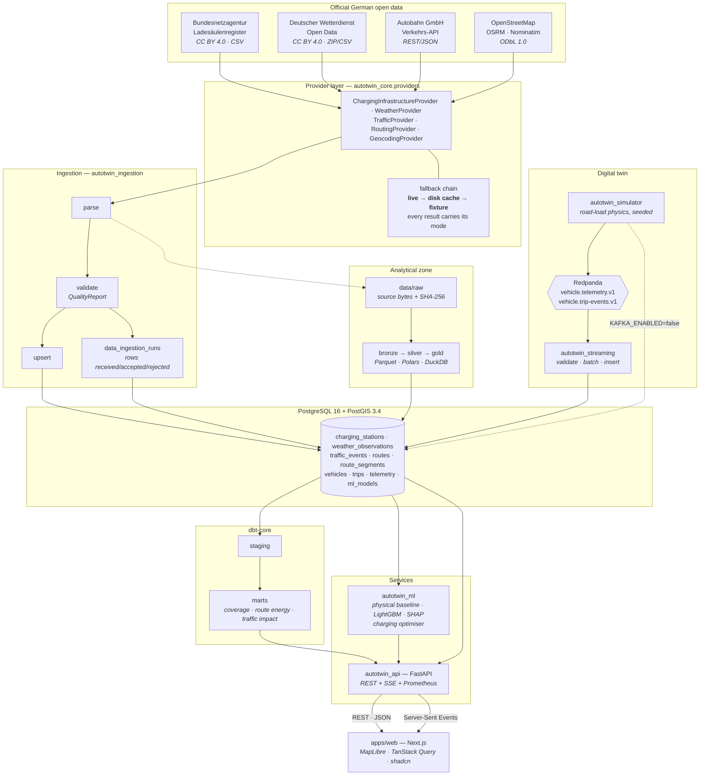
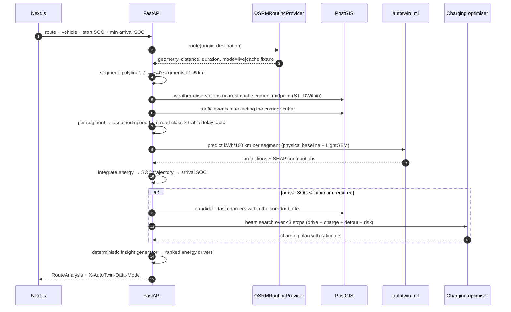

# AutoTwin DE — Architecture

AutoTwin DE combines **official German infrastructure and environment data** with a
**physics-based connected-vehicle simulation** to answer operational questions about electric
mobility: what a journey costs in energy, where the vehicle will arrive, whether it must charge,
and which German corridors are underserved by fast charging.

This document describes how the system is put together and why. The decisions behind it are in
[`docs/adr/`](docs/adr/); the module-level contract is [`docs/BUILD_SPEC.md`](docs/BUILD_SPEC.md).

---

## 1. System overview



Two flows meet in the database. The **left-hand flow** is official data: batch, scheduled,
provenance-stamped. The **right-hand flow** is the digital twin: continuous, simulated, streamed.
They are never merged without a `data_origin` label saying which is which.

---

## 2. Request path — the flagship journey analysis

`POST /api/v1/routes/analyze` for *Frankfurt am Main → Stuttgart* is the path that exercises
almost everything, so it is worth tracing:



The response is one payload containing route geometry, per-segment energy, the SOC trajectory,
traffic and weather context, the charging plan, and a **ranked, human-readable explanation of
what drove the consumption** — produced deterministically from the model's own terms, with no
LLM in the path.

---

## 3. Layers and responsibilities

| Layer | Package | Responsibility | Must not |
|---|---|---|---|
| Contracts | `autotwin_contracts` | Enums, provider records, event schemas, API envelopes, vehicle profiles | import SQLAlchemy, FastAPI, or any sibling |
| Core | `autotwin_core` | Settings, logging, errors, DB session + models, quality framework, geo maths, provider ABCs, disk cache, HTTP client | import a service |
| Ingestion | `autotwin_ingestion` | Concrete adapters, parsing, validation, upsert, run bookkeeping | be imported by the API except for routing |
| Simulator | `autotwin_simulator` | Vehicle physics, trip lifecycle, telemetry emission | write to Kafka directly (it writes to a `TelemetrySink`) |
| Streaming | `autotwin_streaming` | Producer, consumer, batch writer, topic management | contain business logic |
| ML | `autotwin_ml` | Physical baseline, features, training, inference, SHAP, charging optimiser, insights | depend on FastAPI |
| API | `autotwin_api` | HTTP surface, composition, error mapping, SSE, metrics | contain physics or parsing |
| Web | `apps/web` | Presentation, map, interaction, i18n | call `fetch` outside `lib/api` |

The dependency direction is enforced by what each package declares in its own `pyproject.toml`,
not by convention: `autotwin_contracts` *cannot* import SQLAlchemy because it does not depend
on it.

---

## 4. Data provenance

Provenance is a first-class column set, not a comment. Every externally sourced row carries:

```
source · source_identifier · source_url · source_timestamp
data_origin · ingestion_run_id · ingested_at
```

which means any number on any screen can be traced to the ingestion run that produced it, the
URL it came from, and the SHA-256 of the bytes that were downloaded. The `/data-quality` page is
a direct read of that chain: rows received, accepted, rejected, duplicates, freshness, status.

`data_origin` has exactly three values and they are load-bearing:

| value | what it means | where it appears |
|---|---|---|
| `official` | published by a German authority | charging stations, weather, traffic |
| `simulated` | produced by the AutoTwin simulator | vehicles, trips, telemetry, ML labels |
| `derived` | computed by AutoTwin from other rows | route segments, predictions, aggregates |

The UI renders a `SIMULIERT` badge wherever `simulated` appears. See
[ADR 004](docs/adr/004-simulation-vs-real-vehicle-data.md).

---

## 5. Degradation

Public open-data endpoints move and go down. Every provider call returns a `ProviderResult`
carrying `mode ∈ {live, cache, fixture}`, and the mode travels all the way to the browser as the
`X-AutoTwin-Data-Mode` response header.

```
live          the source answered
cache         the source failed; served from data/raw within its TTL
fixture       no cache either; served from a committed fixture built from the real schema
```

No provider failure produces a 500. Typed `ProviderError` subclasses map onto stable error
codes (`provider_unavailable`, `provider_timeout`, `invalid_source_data`, `rate_limited`,
`configuration_missing`) with the right status codes, and the UI shows
*„Live-Quelle nicht verfügbar — zwischengespeicherte Daten"* rather than a blank page.

---

## 6. Streaming

```
simulator ──► TelemetrySink ──┬──► KafkaTelemetrySink ──► Redpanda ──► consumer ──► PostGIS
                              └──► DatabaseTelemetrySink ─────────────────────────► PostGIS
```

Events are JSON inside a versioned envelope carrying `event_id`, `event_type`,
`schema_version`, `occurred_at`, `producer` and `data_origin`. The consumer validates with the
same Pydantic model the producer serialised with, batches (500 rows / 1 s), bulk-inserts, and
commits offsets only after the write succeeds — at-least-once onto an append-only table.

The `TelemetrySink` seam is what keeps `make demo` reliable: if the broker is unavailable, the
simulation still runs and the simulation-status endpoint reports which transport is in use.
See [ADR 002](docs/adr/002-redpanda-for-local-streaming.md) and
[ADR 006](docs/adr/006-json-events-no-schema-registry.md).

---

## 7. Energy model

Two models, always reported together:

1. **Physical baseline** — a longitudinal road-load model (rolling resistance, aerodynamic drag
   with temperature-corrected air density, gradient, inertia, drivetrain and regeneration
   efficiency, auxiliary and HVAC load, cold-battery internal resistance). Transparent,
   inspectable, no training data.
2. **LightGBM regressor** on 20 engineered features, with SHAP attribution for global
   importance and per-prediction explanation.

The ML model is trained on **simulated** telemetry, which means it is validated against the
generator that produced it. That is circular, and the project says so plainly wherever metrics
appear: the claim being demonstrated is the *methodology* — feature engineering, grouped
splitting, baseline comparison, explainability, model registry — not the R².
See [`docs/ml/energy-model.md`](docs/ml/energy-model.md).

---

## 8. Geospatial analytics

The infrastructure analysis runs in PostGIS, not Python:

- **Corridor coverage** — `ST_DWithin(station.location, route.geometry::geography, buffer)`.
- **Gap detection** — project each qualifying charger onto the route with
  `ST_LineLocatePoint`, order by offset, and take `lead(offset) - offset` to get the distance a
  vehicle would travel between charging opportunities.
- **Underserved corridors** — segments where that gap exceeds a configurable threshold for a
  configurable minimum power. All three parameters are exposed in the API and the UI, because the
  answer is only meaningful next to its assumptions.

See [ADR 001](docs/adr/001-postgis-for-geospatial-storage.md).

---

## 9. Deployment topology

```
docker compose up -d                 postgres (5433) · redpanda (19092) · console (8088)
uv run uvicorn autotwin_api.main:app API on 8000
pnpm --dir apps/web dev              web on 3000

--profile full            API + simulator + consumer in containers
--profile routing         local OSRM on 5001
--profile observability   Prometheus 9090 · Grafana 3001
--profile airflow         Airflow webserver 8082 · scheduler
```

The default `up` brings only infrastructure, so the inner development loop stays fast. Nothing
beyond Postgres is required to render the dashboard — everything else degrades visibly.

A production deployment is deliberately **not** implemented. The images are non-root, configured
entirely through environment variables and stateless apart from Postgres, so the path exists;
building a Helm chart for a portfolio project would be scope, not evidence.
See [ADR 009](docs/adr/009-rejected-technologies.md).

---

## 10. Observability

- **Structured logging** (`structlog`) with a `request_id` contextvar bound into every record and
  returned in the error envelope, so a user-visible error maps to a log line.
- **Prometheus metrics** at `/metrics`: `api_requests_total`, `api_request_duration_seconds`,
  `telemetry_events_received_total`, `telemetry_events_failed_total`,
  `active_simulated_vehicles`, `ingestion_rows_processed`, `ingestion_rows_rejected`.
- **Health vs readiness** — `/health` says the process is alive; `/ready` checks the database
  (including that the PostGIS extension is present), the broker and the active ML model.
- Grafana dashboards are an optional profile. Requiring them to look at the product would be a
  poor trade.
