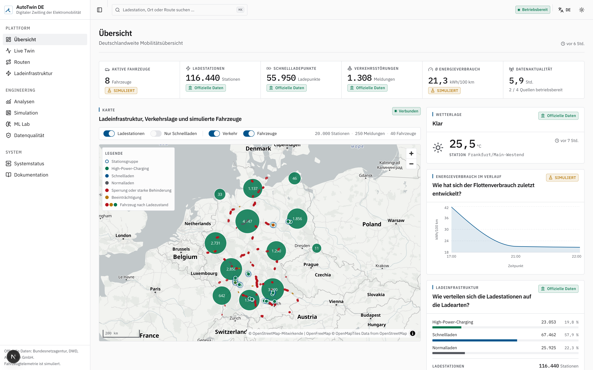

<div align="center">

# AutoTwin DE

### Intelligenter digitaler Zwilling für elektrische Mobilität in Deutschland

**Offizielle Infrastrukturdaten · Streaming-Fahrzeugsimulation · Geodatenanalyse · Machine Learning · Ladeoptimierung**

[English version](README.md) · [Architektur](ARCHITECTURE.md) · [Entscheidungen](docs/adr/) · [Datenquellen](docs/data/sources.md)

</div>

---

## Worum es geht

AutoTwin DE beantwortet betriebliche Fragen zur Elektromobilität in Deutschland:

> *Frankfurt am Main → Stuttgart, eine Limousine mit 70 % Ladezustand, im Februar.*
> **Wie viel Energie benötigt die Fahrt? Mit welchem Ladezustand kommt das Fahrzeug an?
> Ist ein Ladestopp erforderlich, und wo? Und auf welchen deutschen Korridoren ist die
> Schnellladeinfrastruktur zu dünn, um die Fahrt überhaupt zu ermöglichen?**

Die Antworten entstehen aus der Verbindung **offizieller deutscher Open Data** — dem
Ladesäulenregister der Bundesnetzagentur, den Beobachtungsdaten des Deutschen Wetterdienstes und
den Baustellenmeldungen der Autobahn GmbH — mit einer **physikbasierten Simulation** vernetzter
Fahrzeuge, einem **PostGIS**-Geodatenkern und einem Energiemodell, das stets gegen ein
nachvollziehbares physikalisches Basismodell ausgewiesen wird.

Es ist eine Engineering-Plattform, keine Demo: jeder Datensatz führt seine Herkunft mit, jede
externe Quelle degradiert kontrolliert auf Cache und anschließend auf mitgelieferte
Beispieldaten, und simulierte Daten sind überall als solche gekennzeichnet.



---

## Datenherkunft — ehrlich ausgewiesen

Dieser Abschnitt steht bewusst vor der Funktionsliste.

| | Quelle | Lizenz |
|---|---|---|
| 🟢 **Echt** | Ladeinfrastruktur — Ladesäulenregister der Bundesnetzagentur (~117 000 Standorte) | CC BY 4.0 |
| 🟢 **Echt** | Wetter — Deutscher Wetterdienst, 10-Minuten-Stationsbeobachtungen | CC BY 4.0 |
| 🟢 **Echt** | Baustellen, Sperrungen und Warnmeldungen — öffentliche API der Autobahn GmbH | siehe [Hinweis](DATA_LICENSES.md) |
| 🟢 **Echt** | Straßennetz, Routing und Geokodierung — OpenStreetMap über OSRM und Nominatim | ODbL 1.0 |
| 🟡 **Simuliert** | Fahrzeugtelemetrie: Position, Geschwindigkeit, Ladezustand, Batterietemperatur, Leistung | Apache 2.0 (eigene) |
| 🟡 **Simuliert** | Fahrten — und damit die Trainingslabels des ML-Modells | Apache 2.0 (eigene) |

Eine öffentlich zugängliche Quelle für reale Telemetrie vernetzter Fahrzeuge existiert nicht:
OEM-Telematik ist proprietär und personenbezogen. AutoTwin DE simuliert sie deshalb — auf Basis
eines Fahrwiderstandsmodells und nicht mit einem Zufallsgenerator — und weist das auf jeder
Ebene aus:

- jeder Datenbankdatensatz führt `data_origin` ∈ `official | simulated | derived`;
- jeder Kafka-Envelope führt dasselbe Feld;
- die Oberfläche zeigt auf jeder Ansicht mit simulierten Daten ein **`SIMULIERT`**-Kennzeichen;
- die ML-Seite stellt klar, dass ein auf simulierten Labels trainiertes Modell die
  *Methodik* belegt und nicht die Gültigkeit für reale Fahrzeuge.

Siehe [ADR 004](docs/adr/004-simulation-vs-real-vehicle-data.md).

---

## Architektur

```mermaid
flowchart LR
    subgraph SRC["Offizielle deutsche Open Data"]
        direction TB
        BN["Bundesnetzagentur<br/>Ladesäulenregister"]
        DWD["Deutscher<br/>Wetterdienst"]
        AB["Autobahn GmbH<br/>Verkehrs-API"]
        OSM["OpenStreetMap<br/>OSRM · Nominatim"]
    end

    subgraph PROV["Provider-Schicht"]
        direction TB
        ABS["typisierte Schnittstellen<br/>+ typisierte Fehler"]
        FB["live → Cache → Fixture<br/><i>Bezugsweg wird ausgewiesen</i>"]
    end

    ING["Ingestion<br/><i>parsen · validieren · upserten</i>"]
    DB[("PostgreSQL 16<br/>+ PostGIS 3.4")]
    DBT["dbt<br/><i>Staging → Marts</i>"]
    ML["ML<br/><i>Fahrwiderstandsmodell<br/>LightGBM · SHAP<br/>Ladeoptimierung</i>"]
    API["FastAPI<br/><i>REST · SSE · Metriken</i>"]
    WEB["Next.js<br/><i>MapLibre · shadcn</i>"]

    SIM["Fahrzeugsimulator<br/><i>deterministische Physik</i>"]
    RP{{"Redpanda"}}
    CONS["Streaming-Consumer"]

    SRC --> ABS --- FB --> ING --> DB
    DB --> DBT --> API
    DB --> ML --> API
    DB --> API --> WEB
    SIM --> RP --> CONS --> DB
    SIM -.->|"KAFKA_ENABLED=false"| DB
```



Vollständige Diagramme, der Ablauf einer Streckenanalyse und der Schichtenvertrag stehen in
[`ARCHITECTURE.md`](ARCHITECTURE.md).

---

## Funktionsumfang

**Streckenanalyse** — Streckengeometrie aus OSRM, zerlegt in Abschnitte von rund 5 km; Wetter je
Abschnitt von der nächstgelegenen DWD-Station; Verkehrsstörungen dem Korridor zugeordnet;
Energieverbrauch je Abschnitt sowohl aus dem physikalischen Modell als auch aus einem
LightGBM-Regressor; ein Ladezustandsverlauf; und eine **deterministische Erklärung** der
Einflussfaktoren — ohne LLM im Antwortpfad.

**Das Streckenband** — die Darstellungsform, die im deutschen Straßen- und Eisenbahnwesen seit
über hundert Jahren verwendet wird, hier als interaktives SVG-Instrument: Energieintensität als
Farbband, Ladezustand als Linie darüber, Verkehrsstörungen oberhalb, Lademöglichkeiten
unterhalb — alles auf einer gemeinsamen Streckenachse. Vollständig tastaturbedienbar und für
Screenreader lesbar.

**Ladeoptimierung** — Beam-Suche über die Ladestationen im Korridor, die
`Fahrzeit + Ladezeit + 2 × Umwegzeit + Reichweitenrisiko` minimiert, mit einer vereinfachten
ladezustandsabhängigen Ladekurve. Jede Empfehlung nennt den Grund, aus dem sie gewonnen hat.

**Geodatenanalyse der Infrastruktur** — Korridorabdeckung und Erkennung **unterversorgter
Korridore** in PostGIS: Ladestationen werden mit `ST_LineLocatePoint` auf die Strecke projiziert,
Versorgungslücken ergeben sich als Fensterfunktion über den Streckenoffsets. Alle Parameter
(Mindestladeleistung, maximaler Abstand, Korridorbreite) sind einstellbar, denn eine Aussage wie
*„größter Abstand 84 km"* ist ohne ihre Annahmen bedeutungslos.

**Live-Zwilling** — mehrere hundert simulierte Fahrzeuge, die über Redpanda nach PostGIS und per
Server-Sent Events in den Browser strömen; Fahrzeugpositionen werden zwischen den Telemetriedaten
interpoliert.

**Ein MCP-Server statt eines Chatbots** — die Analysen der Plattform als Werkzeuge für jeden
Model-Context-Protocol-Client (Claude Desktop, Cursor, Zed): `analyze_route`,
`plan_charging_stops`, `corridor_coverage`, `underserved_corridors`,
`search_charging_stations`, `data_quality`. Das Modell bringt der Client mit; jede Zahl stammt
aus demselben Code, den auch die API ausliefert — nichts wird erfunden, und kein Schlüssel liegt
im Repository. Siehe [`services/mcp/`](services/mcp/README.md).

**Datenqualität als eigenständige Ansicht** — empfangene, übernommene, verworfene und doppelte
Datensätze je Abruf, die ausgelösten Prüfregeln, Aktualität, Lizenz und Namensnennung.

---

## Technologie

| Schicht | Auswahl | Warum nicht die naheliegende Alternative |
|---|---|---|
| Geodaten | PostgreSQL 16 + PostGIS 3.4 | Korridor- und Lückenanalyse gehört in SQL, nicht in Python-Schleifen ([ADR 001](docs/adr/001-postgis-for-geospatial-storage.md)) |
| Streaming | Redpanda (Kafka-Protokoll) | Kafka-Semantik ohne JVM — und optional ([ADR 002](docs/adr/002-redpanda-for-local-streaming.md)) |
| Analytik | Polars · DuckDB · Parquet | Spark für 10⁵ Datensätze wäre Technologiewahl fürs Lebenslauf-Stichwort ([ADR 007](docs/adr/007-duckdb-polars-over-spark.md)) |
| Transformationen | dbt-core | Echte Lineage und über 440 Tests, keine Dekoration |
| ML | LightGBM + SHAP gegen ein physikalisches Basismodell | Ein Modell ist nur im Vergleich zu einer Baseline belastbar |
| Backend | Python 3.12 · FastAPI · SQLAlchemy 2 · Pydantic v2 | `mypy --strict` über den gesamten Workspace |
| Frontend | Next.js · React 19 · TypeScript · Tailwind 4 · shadcn/ui · MapLibre · TanStack Query · Recharts | Kartenkacheln ohne API-Schlüssel ([ADR 003](docs/adr/003-maplibre-for-mapping.md)) |
| Orchestrierung | Airflow, optionales Compose-Profil | Für das Öffnen eines Dashboards darf kein Scheduler nötig sein |

Bewusst **nicht** eingesetzt, jeweils mit Begründung: Kubernetes, Service Mesh, Spark, Flink,
Redis, Elasticsearch, GraphQL, Event Sourcing, CQRS — siehe
[ADR 009](docs/adr/009-rejected-technologies.md).

**Kostenfrei.** Kein Cloud-Konto, keine kostenpflichtige API, keine Kreditkarte. Alle externen
Quellen sind öffentliche deutsche Open Data oder Community-Infrastruktur, genutzt im Rahmen der
jeweils veröffentlichten Nutzungsbedingungen.

---

## Schnellstart

Voraussetzungen: **Docker**, **[uv](https://docs.astral.sh/uv/)**, **Node 22+** und **pnpm**.

```bash
git clone <dieses-repo> && cd autotwin-de
make setup      # uv sync + pnpm install + .env
make demo       # Datenbank, Migrationen, Demodaten, Simulation — dann http://localhost:3000
```

`make demo` ist idempotent und funktioniert auch **offline**: Ist eine Live-Quelle nicht
erreichbar, greift der Abruf auf die mitgelieferten Beispieldaten zurück und weist das im
Ingestion-Protokoll sowie in der Oberfläche aus, statt veraltete Daten als aktuell darzustellen.

<details>
<summary><b>Einzelne Komponenten starten</b></summary>

```bash
make up                 # Postgres (5433) + Redpanda (19092) + Console (8088)
make db-upgrade         # alembic upgrade head
make ingest-charging    # Bundesnetzagentur → PostGIS
make ingest-weather     # DWD → PostGIS
make ingest-traffic     # Autobahn GmbH → PostGIS
make seed               # Referenzstrecken, Fahrzeuge
make api                # FastAPI auf :8000  (Dokumentation unter /docs)
make web                # Next.js auf :3000
make simulator          # Fahrzeugsimulation starten
make consumer           # Kafka → PostGIS
make ml-train           # Energiemodell trainieren
make dbt-run && make dbt-test
make test lint typecheck
```

Optionale Compose-Profile: `--profile routing` (lokales OSRM), `--profile observability`
(Prometheus + Grafana), `--profile airflow` (geplante Datenabrufe), `--profile full`
(alles containerisiert).

</details>

<details>
<summary><b>Apple Silicon</b></summary>

Das offizielle Image `postgis/postgis` wird nur für amd64 veröffentlicht und läuft auf Apple
Silicon unter Emulation — korrekt, aber bei den Korridorabfragen spürbar langsamer. Für einen
nativen Build:

```bash
echo 'POSTGRES_IMAGE=imresamu/postgis:16-3.5' >> .env && make reset && make demo
```

</details>

---

## Gehostete Demo

Die öffentliche Demo ist ein **vollständig statischer Export** des Frontends, gebaut mit
`NEXT_PUBLIC_DEMO_SNAPSHOT=1`. Sie enthält keinen Server: Jede Seite liest einen **datierten
Snapshot** echter API-Antworten, aufgezeichnet von einer lokal laufenden Plattform mit den
Live-Daten von Bundesnetzagentur, DWD und Autobahn GmbH — und jede Seite trägt einen Hinweis mit
dem Aufnahmedatum. Filter und Seitenwechsel laufen im Browser über die aufgezeichneten
Datensätze; der Ladeinfrastruktur-Explorer enthält die Schnellladestandorte (≥ 50 kW) und sagt
das auch; Aktionen, die ein Backend benötigen — Simulationssteuerung, frei gewählte Strecken —
melden ehrlich „im Snapshot nicht verfügbar".

Die Veröffentlichung auf **GitHub Pages** übernimmt `.github/workflows/deploy-pages.yml`
(einmalig: *Settings → Pages → Source: GitHub Actions*); dasselbe Artefakt läuft unverändert auf
Vercel, Cloudflare Pages oder Netlify.

```bash
# Snapshot aus einer laufenden lokalen Plattform neu erzeugen (vorher: make demo)
uv run python scripts/capture_snapshot.py --api http://localhost:8000

# Export lokal bauen und ansehen
cd apps/web && NEXT_PUBLIC_DEMO_SNAPSHOT=1 pnpm build && npx serve out
```

---

## Das Energiemodell

Zuerst ein **physikalisches Basismodell**, weil es nachvollziehbar ist und keine Trainingsdaten
benötigt:

```
F_Roll   = crr · m · g · cos θ
F_Luft   = ½ · ρ(T) · c_w · A · v²         ρ = 1,225 · 288,15/(273,15 + T)
F_Steig  = m · g · sin θ
F_Träg   = m · a · 1,05
P_Batt   = P_Rad / η_Antrieb  (η = 0,90)   bzw. P_Rad · η_Rekup (0,65, begrenzt auf −50 kW)
P_Neben  = 0,35 kW + Klimatisierung(T)  +  Innenwiderstandszuschlag bei kalter Batterie
```

Es reproduziert genau das Verhalten, auf das es ankommt:

| km/h | −10 °C | 20 °C | 35 °C |
|---:|---:|---:|---:|
| 50 | 16,8 | 9,0 | 12,9 |
| 120 | 23,2 | 17,6 | 18,7 |
| 180 | 38,6 | 31,1 | 31,0 |

*(Limousine, kWh/100 km)* — Kälte kostet bei 50 km/h **+87 %**, bei 180 km/h aber nur **+24 %**,
weil bei niedriger Geschwindigkeit die Klimatisierung und bei hoher Geschwindigkeit der
Luftwiderstand dominiert. Das ist reales Fahrzeugverhalten und ergibt sich aus der Physik, statt
angepasst zu werden.

Darauf aufbauend ein **LightGBM-Regressor** mit 20 Merkmalen, aufgeteilt **gruppiert nach Fahrt**
(aufeinanderfolgende Zeitfenster einer Fahrt sind stark korreliert; eine zufällige
Zeilenaufteilung führt zu Leakage und einem geschönten R²), ausgewertet auf denselben
zurückgehaltenen Daten wie das Basismodell, mit SHAP-Attribution.

> **Dies ist ein Forschungsprototyp im Engineering-Kontext.** Die Konstanten sind öffentlich
> dokumentierte Größenordnungen für Fahrzeugklassen, keine Herstellerdaten; die Trainingslabels
> sind simuliert, das Modell wird also gegen seinen eigenen Generator validiert. Dieser Zirkel
> wird überall dort benannt, wo Kennzahlen erscheinen, und ist der Grund, warum das Basismodell
> immer daneben steht. Belegt wird die Methodik.

Einzelheiten: [`docs/ml/energy-model.md`](docs/ml/energy-model.md),
[`docs/ml/methodology.md`](docs/ml/methodology.md).

---

## Grenzen

- Die Fahrzeugtelemetrie ist simuliert. Siehe oben — das ist die zentrale Einschränkung.
- Keine Höhendaten. OSRM liefert kein Höhenprofil, die Steigungen je Abschnitt sind daher
  synthetisch. Ein produktives System würde ein digitales Geländemodell (SRTM/Copernicus)
  verwenden. Die Steigung ist damit die schwächste Eingangsgröße des Energiemodells.
- Die Ladekurven sind eine vereinfachte dreiteilige Näherung. Reale Kurven sind
  herstellerspezifisch, temperaturabhängig und proprietär.
- Die **Verfügbarkeit** von Ladepunkten wird nicht modelliert — das Ladesäulenregister führt
  Standorte, keine Echtzeitbelegung. Eine Fahrtplanung nimmt jede Ladesäule als frei an.
- Die Autobahn-API deckt nur das Bundesfernstraßennetz ab und veröffentlicht keine
  Lizenzangabe ([warum das relevant ist](DATA_LICENSES.md)).
- Bewusst als Einzelknoten ausgelegt. Kubernetes ist ein dokumentierter Weg, keine
  Implementierung.

---

## Ausblick

Dokumentiert, nicht zugesagt: Reichweitenprognose auf Basis realer Flottendaten ·
Verkehrsprognose · Prognose des Ladebedarfs · optimale Standortplanung für Ladeinfrastruktur ·
Vehicle-to-Grid · C-ITS / V2X · Flottenoptimierung · CO₂-optimiertes Routing. Siehe
[`docs/research/`](docs/research/).

---

## Status, Umfang und Haftungsausschluss

Dies ist ein **persönliches Portfolio- und Forschungsprojekt einer einzelnen Person**. Es dient
dem Nachweis von Engineering-Methodik. Es ist kein Produkt, kein Dienst und steht in keiner
Verbindung zur Bundesnetzagentur, zum Deutschen Wetterdienst, zur Autobahn GmbH des Bundes,
zu OpenStreetMap oder zu einem Fahrzeughersteller, Ladenetzbetreiber oder einer sonstigen
Organisation; es wird von keiner dieser Stellen unterstützt oder vertreten. Namen von
Organisationen und Produkten dienen ausschließlich der Bezeichnung von Datenquellen und
gehören ihren jeweiligen Inhabern.

- **Nicht für den operativen Einsatz.** Nichts in diesem Projekt eignet sich zur Planung einer
  realen Fahrt, zur Dimensionierung realer Infrastruktur, zur Bewertung eines realen Fahrzeugs
  oder als Grundlage für Entscheidungen mit sicherheitsrelevanten, finanziellen oder
  rechtlichen Folgen. Das Energiemodell ist eine didaktische Näherung, die Fahrzeugprofile sind
  generische Klassenwerte, und sämtliche Fahrzeugtelemetrie ist simuliert.
- **Keine Gewährleistung.** Der Quellcode steht unter Apache 2.0 und wird *wie besehen* ohne
  jede ausdrückliche oder stillschweigende Gewährleistung bereitgestellt — siehe
  [LICENSE](LICENSE). Für Richtigkeit, Vollständigkeit oder Aktualität der eingelesenen
  Datensätze wird keine Zusicherung gegeben; diese verbleiben in der Verantwortung und im
  Eigentum ihrer Herausgeber — siehe [DATA_LICENSES.md](DATA_LICENSES.md).
- **Open Data wird so genutzt, wie es veröffentlicht ist.** Amtliche Datensätze werden über ihre
  öffentlichen Schnittstellen im Rahmen der veröffentlichten Nutzungsbedingungen abgerufen,
  lokal zwischengespeichert und von diesem Repository **nicht weiterverbreitet** — abgesehen
  von den kleinen, mit Quellenangabe versehenen Testdaten, die zum Offline-Betrieb der Parser
  nötig sind. Sollten Sie einen Datenherausgeber vertreten und eine Nutzung für nicht
  bedingungskonform halten, eröffnen Sie bitte ein Issue; es wird umgehend korrigiert.
- **Keine personenbezogenen Daten.** Die Anwendung erhebt nichts von ihren Nutzern, setzt keine
  Tracking-Cookies, und die simulierten Fahrzeuge entsprechen keinem realen Fahrzeug, keiner
  Person und keiner Fahrt.
- **Eine gehostete Demo, sofern vorhanden, ist ein statischer Snapshot** der Plattformausgabe
  zu einem angegebenen Datum, ohne laufendes Backend, und auf jeder Seite als solcher
  gekennzeichnet.

---

## Lizenz

Quellcode: **Apache 2.0** ([LICENSE](LICENSE)).
Die eingelesenen Datensätze behalten ihre eigenen Lizenzen und Namensnennungspflichten — diese
werden durch dieses Repository **nicht** verändert. Siehe
[**DATA_LICENSES.md**](DATA_LICENSES.md).

```
Ladesäulenregister der Bundesnetzagentur — CC BY 4.0
Quelle: Deutscher Wetterdienst — CC BY 4.0
Daten: Autobahn GmbH des Bundes
© OpenStreetMap-Mitwirkende — ODbL 1.0
```
