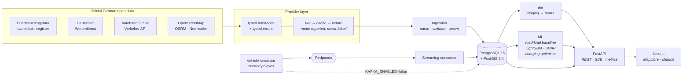
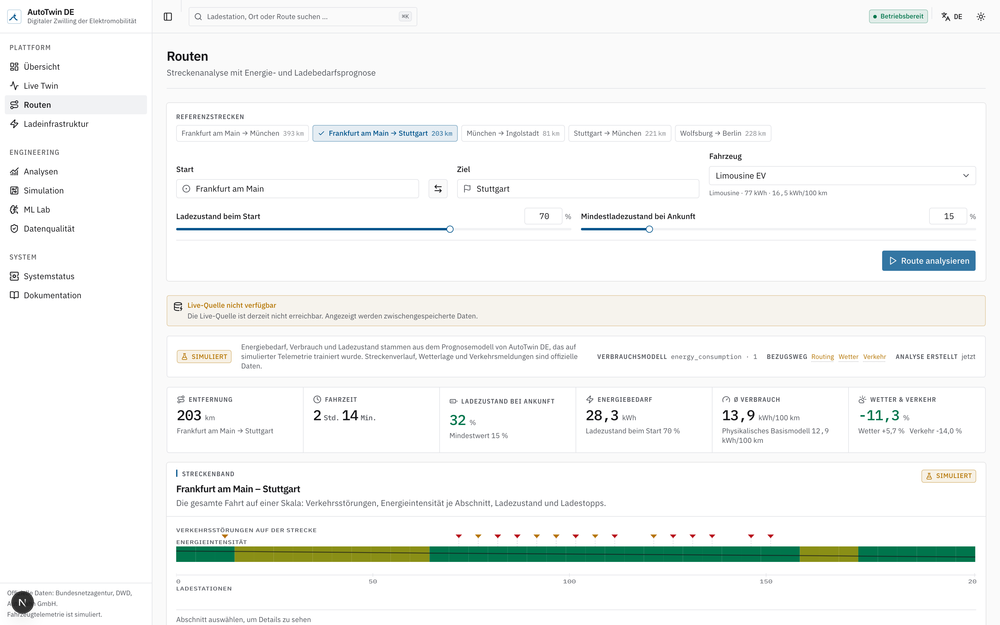
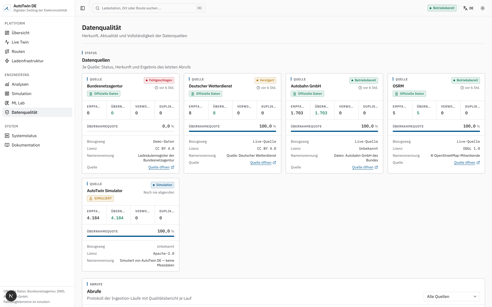
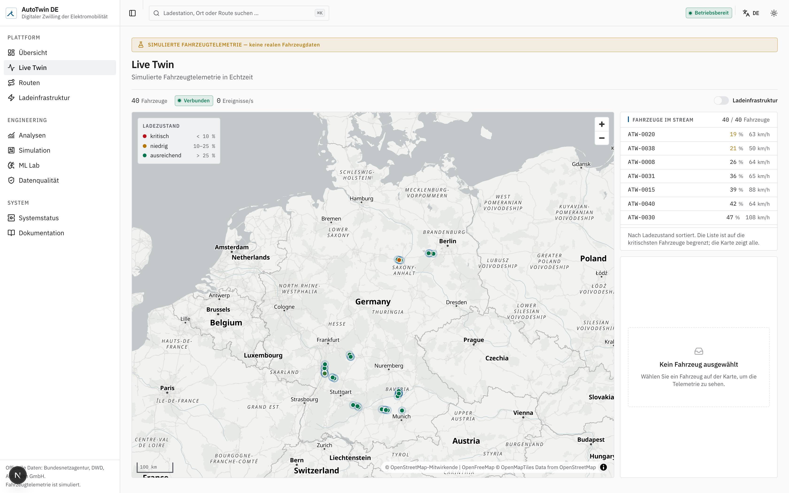
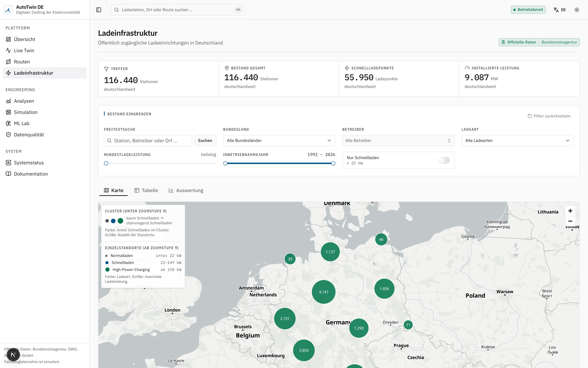
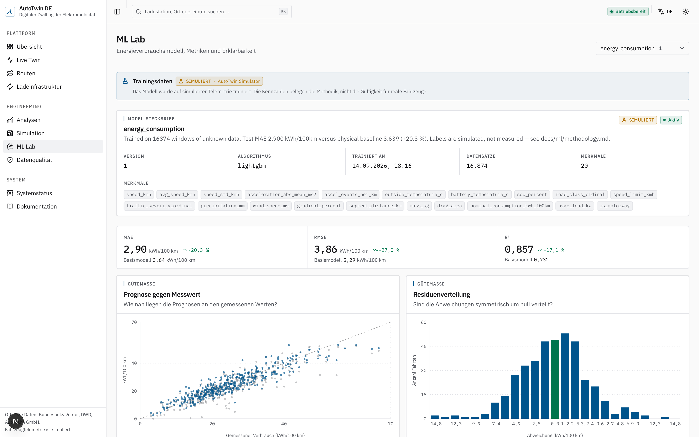
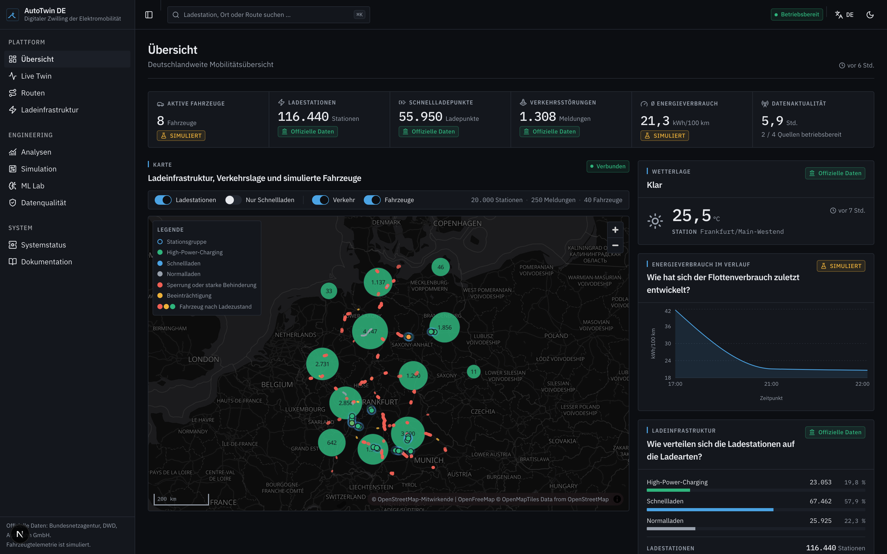

<div align="center">

# AutoTwin DE

### Intelligent Digital Twin for German Electric Mobility

**Real German infrastructure data · streaming vehicle simulation · geospatial analytics · machine learning · charging optimisation**

[Deutsche Version](README.de.md) · [Architecture](ARCHITECTURE.md) · [Decisions](docs/adr/) · [Data sources](docs/data/sources.md)

</div>

---

## What it is

AutoTwin DE answers operational questions about electric mobility in Germany:

> *Frankfurt am Main → Stuttgart, a sedan EV at 70 % charge, in February.*
> **How much energy does it take? What charge will it arrive with? Must it stop? Where?
> And which German corridors are too thin on fast charging for anyone to make that trip?**

It answers them by combining **official German open data** — the Bundesnetzagentur charging
registry, Deutscher Wetterdienst observations, Autobahn GmbH roadworks — with a
**physics-based simulation** of connected vehicles, a **PostGIS** geospatial core, and an energy
model that is always reported against a transparent physical baseline.

It is an engineering platform, not a demo: every row carries provenance, every external source
degrades to cache and then to a committed fixture, and simulated data is labelled as simulated
everywhere it appears.


<sub>116 440 charging stations from the live Bundesnetzagentur register, 1 300+ live Autobahn
disruptions, simulated vehicles on the map — and every tile saying which of those it is.</sub>

---

## Honest data provenance

This is the part of the project that matters most, so it comes before the feature list.

| | Source | Licence |
|---|---|---|
| 🟢 **Real** | Charging infrastructure — Bundesnetzagentur *Ladesäulenregister* (~117 000 sites) | CC BY 4.0 |
| 🟢 **Real** | Weather — Deutscher Wetterdienst open data, 10-minute station observations | CC BY 4.0 |
| 🟢 **Real** | Roadworks, closures and warnings — Autobahn GmbH public API | see [caveat](DATA_LICENSES.md) |
| 🟢 **Real** | Road network, routing and geocoding — OpenStreetMap via OSRM and Nominatim | ODbL 1.0 |
| 🟡 **Simulated** | Vehicle telemetry: position, speed, state of charge, battery temperature, power | Apache 2.0 (ours) |
| 🟡 **Simulated** | Trips, and therefore the ML model's training labels | Apache 2.0 (ours) |

No public feed of real connected-vehicle telemetry exists — OEM telematics is proprietary and
carries personal data. So AutoTwin DE simulates it, from a road-load physics model rather than a
random-number generator, and says so at every layer:

- every database row carries `data_origin` ∈ `official | simulated | derived`;
- every Kafka envelope carries it too;
- the UI renders a **`SIMULIERT`** badge on every surface backed by simulated data;
- the ML page states plainly that a model trained on simulated labels demonstrates
  *methodology*, not validity for any real vehicle.

See [ADR 004](docs/adr/004-simulation-vs-real-vehicle-data.md).

---

## Architecture



Full diagrams, the request path for a route analysis, and the layer contract are in
[`ARCHITECTURE.md`](ARCHITECTURE.md).

---

## Features

**Journey analysis** — route geometry from OSRM, cut into ~5 km segments; weather matched to
each segment from the nearest DWD station; traffic events matched to the corridor; per-segment
energy from both a physical road-load model and a LightGBM regressor; a state-of-charge
trajectory; and a **deterministic explanation** of what drove the consumption — no LLM in the
path.

**The Streckenband** — the route strip diagram German road engineers have used for a century,
rebuilt as an interactive SVG instrument: energy intensity as a colour band, SOC as a line
across it, traffic above, charging opportunities below, all on one distance axis. Keyboard
navigable and screen-reader legible.



<sub>Frankfurt am Main → Stuttgart, a sedan EV at 70 %: 203 km, 2 h 14, arriving at 32 %,
28.3 kWh — with the physical baseline (12.9) shown next to the model (13.9 kWh/100 km), and
the live source honestly reported as unavailable.</sub>

**Charging optimisation** — beam search over corridor chargers, minimising
`driving + charging + 2 × detour + range risk`, with a simplified SOC-dependent charging curve.
Each recommendation carries the reason it won.

**Geospatial infrastructure analytics** — corridor coverage and *underserved corridor* detection
in PostGIS: chargers projected onto the route with `ST_LineLocatePoint`, gaps as a window
function over the offsets, all parameters (minimum power, maximum gap, corridor width) exposed
because a number like *"largest gap 84 km"* is meaningless without them.

**Live digital twin** — hundreds of simulated EVs streaming through Redpanda into PostGIS and
out to the browser over Server-Sent Events, with marker positions interpolated between ticks.

**Data quality as a first-class surface** — rows received / accepted / rejected / duplicate per
ingestion run, the validation rules that fired, freshness, licence and attribution, all readable
in the UI.



<sub>Per source: status, acceptance rate, whether the answer came from the live source or a
cache, the licence, and the attribution it obliges. A failed ingestion is shown as failed.</sub>

<details>
<summary><b>More screens</b></summary>

| | |
|---|---|
|  |  |
| **Live Twin** — simulated EVs streaming over SSE, coloured by state of charge | **Ladeinfrastruktur** — 116 440 sites, clustered, filterable, with full provenance |
|  |  |
| **ML Lab** — LightGBM against the physical baseline, SHAP importances | Light and dark, both first-class |

Every screenshot is produced by `apps/web/tests/e2e/screenshots.spec.ts`, which drives the same
flows as the smoke tests — so a screenshot cannot show a screen that does not work.

</details>

---

## Technology

| Layer | Choice | Why not the obvious alternative |
|---|---|---|
| Geospatial | PostgreSQL 16 + PostGIS 3.4 | Corridor and gap analysis belongs in SQL, not Python loops ([ADR 001](docs/adr/001-postgis-for-geospatial-storage.md)) |
| Streaming | Redpanda (Kafka API) | Kafka semantics without the JVM; and it is *optional* ([ADR 002](docs/adr/002-redpanda-for-local-streaming.md)) |
| Analytics | Polars · DuckDB · Parquet | Spark for 10⁵ rows would be résumé-driven design ([ADR 007](docs/adr/007-duckdb-polars-over-spark.md)) |
| Transformations | dbt-core | Real lineage and 440+ tests, not decoration |
| ML | LightGBM + SHAP, against a physical baseline | A model is only credible next to a baseline |
| Backend | Python 3.12 · FastAPI · SQLAlchemy 2 · Pydantic v2 | `mypy --strict` across the whole workspace |
| Frontend | Next.js · React 19 · TypeScript · Tailwind 4 · shadcn/ui · MapLibre · TanStack Query · Recharts | Keyless tiles, no Mapbox token ([ADR 003](docs/adr/003-maplibre-for-mapping.md)) |
| Orchestration | Airflow, behind an optional Compose profile | Opening a dashboard must not require a scheduler |

Deliberately **not** used, with reasons: Kubernetes, service mesh, Spark, Flink, Redis,
Elasticsearch, GraphQL, event sourcing, CQRS — see
[ADR 009](docs/adr/009-rejected-technologies.md).

**Zero cost.** No cloud account, no paid API, no credit card. Every external source is public
German open data or community infrastructure, used within its published terms.

---

## Quick start

Requires **Docker**, **[uv](https://docs.astral.sh/uv/)**, **Node 22+** and **pnpm**.

```bash
git clone <this-repo> && cd autotwin-de
make setup      # uv sync + pnpm install + .env
make demo       # database, migrations, demo data, simulation — then open http://localhost:3000
```

`make demo` is idempotent and works **offline**: when a live source cannot be reached it falls
back to the committed fixtures and says so in the ingestion log and in the UI, rather than
pretending the data is current.

<details>
<summary><b>Running the pieces individually</b></summary>

```bash
make up                 # postgres (5433) + redpanda (19092) + console (8088)
make db-upgrade         # alembic upgrade head
make ingest-charging    # Bundesnetzagentur → PostGIS
make ingest-weather     # DWD → PostGIS
make ingest-traffic     # Autobahn GmbH → PostGIS
make seed               # demo corridors, vehicles
make api                # FastAPI on :8000  (docs at /docs)
make web                # Next.js on :3000
make simulator          # start the vehicle simulation
make consumer           # Kafka → PostGIS writer
make ml-train           # train the energy model
make dbt-run && make dbt-test
make test lint typecheck
```

Optional Compose profiles: `--profile routing` (local OSRM), `--profile observability`
(Prometheus + Grafana), `--profile airflow` (scheduled ingestion), `--profile full`
(everything containerised).

</details>

<details>
<summary><b>Apple Silicon</b></summary>

The official `postgis/postgis` image publishes amd64 only and runs under emulation on Apple
Silicon — correct, but slower on the corridor-gap queries. For a native build:

```bash
echo 'POSTGRES_IMAGE=imresamu/postgis:16-3.5' >> .env && make reset && make demo
```

</details>

---

## The energy model

A **physical baseline** first, because it is inspectable and needs no training data:

```
F_roll  = crr · m · g · cos θ
F_aero  = ½ · ρ(T) · c_d · A · v²          ρ = 1.225 · 288.15/(273.15 + T)
F_grade = m · g · sin θ
F_inert = m · a · 1.05
P_batt  = P_wheel / η_drive   (η = 0.90)   or  P_wheel · η_regen (0.65, floored at −50 kW)
P_aux   = 0.35 kW + HVAC(T)   +  cold-battery internal-resistance penalty
```

It reproduces the behaviour that matters, which is why it is worth having:

| km/h | −10 °C | 20 °C | 35 °C |
|---:|---:|---:|---:|
| 50 | 16.8 | 9.0 | 12.9 |
| 120 | 23.2 | 17.6 | 18.7 |
| 180 | 38.6 | 31.1 | 31.0 |

*(sedan EV, kWh/100 km)* — cold costs **+87 %** at 50 km/h but only **+24 %** at 180 km/h,
because HVAC dominates at low speed and aerodynamic drag at high speed. That is real EV
behaviour, and it falls out of the physics rather than being fitted.

Then a **LightGBM regressor** on 20 engineered features, split **grouped by trip** (consecutive
windows of one trip are correlated; a random row split leaks and inflates R²), reported on the
same held-out rows as the baseline, with SHAP attribution.

> **This is an engineering research prototype.** The constants are public class-level figures,
> not manufacturer data; the training labels are simulated, so the model is validated against
> the generator that produced them. That is circular, it is stated wherever metrics appear, and
> it is why the baseline is always shown alongside. The claim is the methodology.

Details: [`docs/ml/energy-model.md`](docs/ml/energy-model.md),
[`docs/ml/methodology.md`](docs/ml/methodology.md).

---

## Verified

Every number below is reproducible with `make ci` and `make demo`.

| | |
|---|---|
| Backend tests | **1 082 passing** (`pytest`), 1 025 in the no-database CI selection |
| Frontend tests | **322 passing** (Vitest) |
| End-to-end | **20 passing** (Playwright), incl. the full Frankfurt→Stuttgart analysis |
| dbt | 9 marts, 1 incremental model, **440+ tests** against the live warehouse |
| Types | **`mypy --strict` clean across 114 source files**; TypeScript strict clean |
| Lint | `ruff` clean across 174 files; `eslint` clean |

The test suites were written against independently derived values rather than current output —
the aerodynamic term is checked against the v³ law, charging times against a closed-form
integral of the taper, the gradient term against m·g·h computed by hand. **They found seven
real defects**, each now pinned by the regression test that first documented it. Two more came
out of manual verification, including map layers gated on a MapLibre event that never fires in
a throttled render loop, which silently emptied every map in a background tab or a CI browser.

---

## Limitations

- Vehicle telemetry is simulated. See above; it is the central caveat.
- No elevation data. OSRM returns no profile, so segment gradients are synthesised — a real
  system would use a DEM (SRTM/Copernicus). Gradient is therefore the weakest input to the
  energy model.
- Charging curves are a simplified three-segment approximation. Real curves are
  manufacturer-specific, temperature-dependent and proprietary.
- Charger *availability* is not modelled — the Bundesnetzagentur registry lists sites, not
  live occupancy. A trip plan assumes every charger is free.
- The Autobahn API covers the federal motorway network only, and publishes no licence
  statement ([why that matters](DATA_LICENSES.md)).
- Single-node by design. Kubernetes is a documented path, not an implementation.

---

## Roadmap

Documented, not promised: EV range prediction from real fleet data · traffic forecasting ·
charger demand prediction · optimal infrastructure placement · vehicle-to-grid · C-ITS / V2X ·
fleet optimisation · carbon-aware routing. See [`docs/research/`](docs/research/).

---

## Licence

Source code: **Apache 2.0** ([LICENSE](LICENSE)).
The ingested datasets keep their own licences and required attributions — these are **not**
relicensed by this repository. See [**DATA_LICENSES.md**](DATA_LICENSES.md).

```
Ladesäulenregister der Bundesnetzagentur — CC BY 4.0
Quelle: Deutscher Wetterdienst — CC BY 4.0
Daten: Autobahn GmbH des Bundes
© OpenStreetMap-Mitwirkende — ODbL 1.0
```
